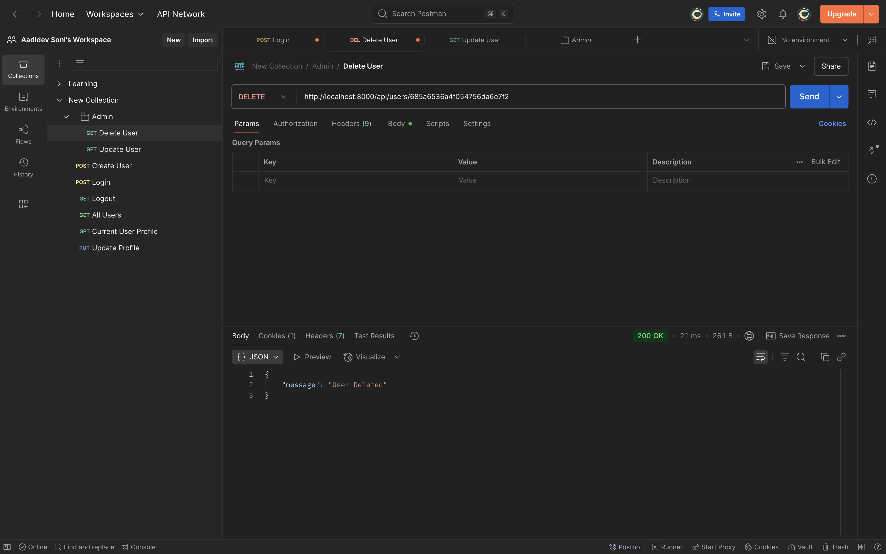
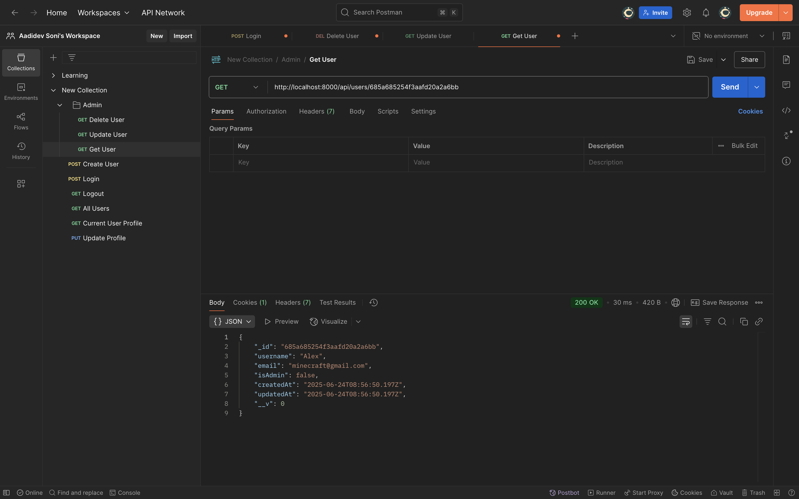
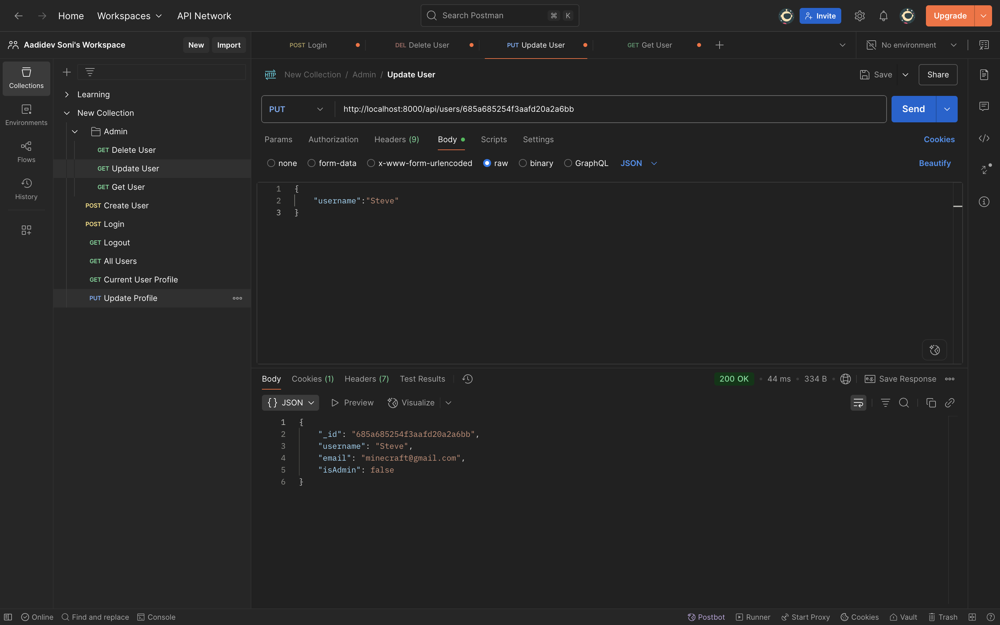

# E-Commerce-Store
<h1>Building an E-Commerce Store</h1>

<h1>Setup:</h1>

<h2>Creating frontend folder with react vite environment</h2>
<ul>
  <li>Open the folder with terminal and run:</li>
  <li>npm create vite@latest frontend -- --template react</li>
</ul>

<h2>Then, to install all dependencies:</h2>
<ul>
  <li>cd frontend</li>
  <li>npm i </li>
</ul>

<p>Now, Open folder in VS Code and you will have all dependencies in frontend folder</p>
<p>npm init -y to initialize your project in main folder. This creates package.json</p>
<p>Create backend folder</p>

<h2>Installing every dependencies for backend:</h2>
<p>npm i nodemon multer mongoose jsonwebtoken express-formidable express-async-handler express dotenv cors cookie-parser concurrently bcryptjs</p>

<h2>Use of each Packages</h2>

<h2>🔁 nodemon</h2>
Use: Automatically restarts your Node.js server when file changes are detected.
Example: Useful in development to avoid manually restarting the server every time you change a file.

<h2>📦 multer</h2>
Use: Middleware for handling multipart/form-data, used for uploading files.
Example: File/image uploads in user profiles or product listings.

<h2>🍃 mongoose</h2>
Use: ODM (Object Data Modeling) library for MongoDB.
Example: Allows defining schemas and models for interacting with MongoDB documents using JavaScript.

<h2>🔐 jsonwebtoken</h2>
Use: Creates and verifies JWT (JSON Web Tokens) for authentication and authorization.
Example: Used to protect routes and verify users in login/signup systems.

<h2>📝 express-formidable</h2>
Use: Parses form data, including file uploads (alternative to multer, simpler but less powerful).
Example: Used to handle form submissions without needing separate body-parser or multer.

<h2>⚙️ express-async-handler</h2>
Use: Simplifies error handling in async/await route handlers.
Example: Wrap your async controller functions to automatically forward errors to Express error middleware.

<h2>🌍 express</h2>
Use: Core framework for building web servers and APIs in Node.js.
Example: Handles routing, middleware, HTTP methods, etc.

<h2>🔐 dotenv</h2>
Use: Loads environment variables from .env file into process.env.
Example: Store secrets like DB_URI, JWT_SECRET, PORT, etc.

<h2>🔄 cors</h2>
Use: Enables Cross-Origin Resource Sharing.
Example: Allow your frontend (e.g., running on localhost:3000) to access your backend server (localhost:5000).

<h2>🍪 cookie-parser</h2>
Use: Parses Cookie header and populates req.cookies with an object.
Example: Used for session management or JWT stored in cookies.

<h2>🚀 concurrently</h2>
Use: Runs multiple commands/scripts in parallel.
Example: Run both frontend (npm start) and backend (npm run dev) in one command:

<h2>🔐 bcryptjs</h2>
Use: Library for hashing passwords.
Example: Hash user passwords before saving to the database and compare during login.

<h2>Installing every dependencies for frontend:</h2>
<p>cd frontend </p>
<p>npm i slick-carousel react-slick react-toastify react-router react-router-dom react-redux react-icons apexcharts rea
ct-apexcharts moment flowbite axios @reduxjs/toolkit @paypal/react-paypal-js</p>

<h2>Use of each Packages</h2>

<h2>🎠 slick-carousel</h2>
Use: CSS/JS files for carousel/slider styling used by react-slick.
Example: Enables responsive image sliders or product carousels.

<h2>🚗 react-slick</h2>
Use: React component for building carousels/sliders.
Example: Product sliders on an e-commerce homepage.

<h2>🔔 react-toastify</h2>
Use: Display toast notifications (e.g., success, error, info messages).
Example: “Product added to cart” or “Login failed” popup.

<h2>🧭 react-router and react-router-dom</h2>
Use: For routing/navigation in React apps.
Example: Page navigation without full page reloads.

<h2>🧠 react-redux</h2>
Use: Connects React with Redux for global state management.
Example: Share user data or cart items across components.

<h2>🎨 react-icons</h2>
Use: Easily use popular icons (FontAwesome, Bootstrap Icons, etc.) in React.
Example: Add shopping cart or menu icons without SVG files.

<h2>📊 apexcharts</h2>
Use: A charting library to visualize data.
Example: Sales charts, order trends, etc.

<h2>📊 react-apexcharts</h2>
Use: React wrapper for apexcharts.
Example: Use ApexCharts in React with simple components.

<h2>🕒 moment</h2>
Use: Date and time manipulation.
Example: Format timestamps like 2 hours ago, 12/06/2024.

<h2>💧 flowbite</h2>
Use: UI component library built on Tailwind CSS.
Example: Add pre-styled modals, buttons, and navbars quickly.

<h2>🔗 axios</h2>
Use: Promise-based HTTP client for making API requests.
Example: Fetch products from your backend or send login data.

<h2>🧰 @reduxjs/toolkit</h2>
Use: Official, modern way to write Redux logic with less boilerplate.
Example: Create slices for cart, user, or orders; better dev experience than vanilla Redux.

<h2>💸 @paypal/react-paypal-js</h2>
Use: Integrate PayPal checkout buttons into your React app.
Example: Allow users to make payments through PayPal on your e-commerce platform.

<h2>CLEANUP:</h2>
<p>frontend - public , src > assets , App.css , index.css</p>

<h2>App.jsx modified to:</h2>

<p>function App() {

  return (
    <>Hello</>
  )
}

export default App</p>

<h2>main.jsx modified to remove:</h2>

<p>import index.css</p>

<h2>Scripts in package.json:</h2>

<p>"scripts": {
  "backend": "nodemon backend/index.js",
  "frontend": "npm run dev --prefix frontend",
  "dev": "concurrently \"npm run frontend\" \"npm run backend\""
},</p>

<h2>backend folder creation:</h2>
<ul>
  <li>config</li>
  <li>contollers</li>
  <li>middlewares</li>
  <li>models</li>
  <li>routes</li>
  <li>utils</li>
  <li>index.js</li>
</ul>

<h3>On running npm run backend, whatever is in the index.js runs</h3>
<h3>To run the front end, we write npm run frontend</h3>

<uL>
  <li>Creating db.js in config and connecting it to MongoDB</li>
  <li>Creating .env with port and URI and using it in db.js</li>
  <li>Adding "type":"module" to package.json</li>
  <li>Importing all packages and utiles and running the app and listening to the port</li>
</ul>

<h2>POSTMAN</h2>
<p>Open Postman and add a blank collect new Request and add http://localhost:8000/ and SEND to see if the backend works</p>

<h2>Download Tailwindcss as per:</h2>
<h3>https://tailwindcss.com/docs/installation/using-vite</h3>

Do all necessary commands and create an index.css and tailwind in App.jsx and dont forget to import './index.css'; in main.jsx


<h1>User Management</h1>
<h2>Creating a new user</h2>
<p>App uses user api routes in index.js</p>
<p>Creating userModel</p>
<p>Creating userRoutes</p>
<p>Creating an asyncHandler for catching errors of every async functions</p>
<p>Creating userController</p>
<p>Testing it out using Postman using a post request</p>
<p>Getting user info from body and printing in console</p>
<p>Providing all validations</p>
<p>Creating a new user anhd testing it in Postman</p>
<p>The newly created user should be visible in mongoDB database</p>

<p>But we can see the user password in database</p>
<p>Handling visibility of password using bcrypt and hashing</p>


<h2>How to create a token and set the token to cookies</h2>
<p>createToken.js in utils</p>
<p>Create token using jwt</p>
<p>Set JWT as an HTTP only cookie</p>
<p>import createToken in userController</p>
<p>Create token just after saving the user to the database</p>
<p>Test by creating a new user in Postman and you can see the cookie creation in postman</p>
<p>This means that this user is not only in database but is also succesffully logged in</p>

<h2>Logging in and Logging out of User</h2>
<h3>Logging In</h3>
<p>Authorising user in router using a new link and loginUser controller</p>
<p>Create loginUser logic in userController</p>
<p>Go to Postamn and post email and password in http://localhost:8000/api/users/auth to login</p>

<h3>Logging out</h3>
<p>Create a new link and controller in router for logging out</p>
<p>>Create logout current user logic in user controller</p>
<p>Logout logic is just to delete the cookie that we created on logging in</p>
<p>Test the logging in and logging out in postman</p>


<h2>Authentication and Authorisation</h2>
<p>Create authenticate middleware and provide logic for authorisation and authentication</p>
<p>Now import authenticate and authorization to userRoute and if the user is authentricated nad authorized, we print all users</p>
<p>Provide the getAllUsers logic in userController</p>
<p>Postman create a admin account</p>
<p>Create a new Get request and set link to api/users to get all the users database</p>


<h2>Updating specific user data</h2>
<h3>Getting current user profile</h3>
<p>Creating a /profile route for updating profile</p>
<p>Creating getCurrentUserProfile controller</p>
<p>Getting current profile info in postman</p>

<h3>Updating now</h3>
<p>Add a put method and update controller to profile route</p>
<p>Create the update profile logic</p>
<p>Test in postman with a new put request to update user profile</p>


<h2>Deleting specific user from admin side</h2>
<p>Create a delete user by id route and provide deleteUser logic</p>
<p>Test in postman with delete</p>


<h2>Getting specific user from admin side</h2>
<p>Adding a get method to getUserById on the same id route</p>
<p>Provide logic for getUserById and test in Postman</p>


<h2>Updating specific user from admin side</h2>
<p>Adding a put method to getUserById on the same id route</p>
<p>Provide logic for updateUser and test in Postman</p>


<h1>Final Code for backend of Users</h2>

<h2>db.js - Connecting to Mongoose database</h2>

```jsx
import mongoose from "mongoose";

const connectDB = async() => {
  try {

    await mongoose.connect(process.env.MONGO_URI);
    console.log("Connected Successfully to MongoDB");
    
  } catch (error) {
    console.error(`ERROR: ${error.message}`);
    process.exit(1); //Exit out of everything that is running right now
  }
}

export default connectDB;
```

<h2>index.js - Main File that runs on starting the backend</h2>


```jsx
//packages
import path from 'path'
import express from 'express'
import dotenv from 'dotenv'
import cookieParser from 'cookie-parser'

//Utiles
import connectDB from './config/db.js'
import userRoutes from './routes/userRoutes.js'

//dotenv: Loads environment variables from .env into process.env.
dotenv.config()
const port = process.env.PORT || 8000;

connectDB();

const app = express();

app.use(express.json());
app.use(express.urlencoded({extended:true}));
app.use(cookieParser());
/*express.json(): Parses incoming JSON request bodies (e.g., for APIs).
express.urlencoded(): Parses form data (from HTML forms).
cookieParser(): Parses cookie headers (e.g., for sessions or JWTs stored in cookies).*/

app.use('/api/users',userRoutes);

app.listen(port, () => console.log("Server running on port " + port));
```

<h2>userModel.js - Model and Schema of the User Database</h2>

```jsx
//packages
import mongoose, { mongo } from "mongoose";

const userSchema = mongoose.Schema({
  username: {type:String,required:true},
  email: {type:String,required:true,unique:true},
  password: {type:String,required:true},
  isAdmin: {type:Boolean,required:true,default:false}
},
{timestamps:true}); //timestamps - Gives specific time when we delete or update user

const User = mongoose.model('User',userSchema);

export default User;
```

<h2>userRoutes.js - Contains the route for every links</h2>

```jsx
import express from "express";
import { createUser,loginUser,logoutCurrentUser,getAllUsers,getCurrentUserProfile,updateCurrentUserProfile,
         deleteUserById,getUserById,updateUserById } from "../controllers/userController.js";
import { authenticate,authorizedAdmin } from "../middlewares/authMiddleware.js";
const router = express.Router()

//createUser is a controller which is handled by asyncHandler
//If the user is authenticated and authorized, we get all the users
router.route('/').post(createUser).get(authenticate,authorizedAdmin,getAllUsers); 
router.post('/auth',loginUser);
router.post('/logout',logoutCurrentUser);  

//The user can change profile only if he is authenticated
router.route('/profile').get(authenticate,getCurrentUserProfile).put(authenticate, updateCurrentUserProfile);

//Admin routes
router.route('/:id')
  .delete(authenticate,authorizedAdmin,deleteUserById)
  .get(authenticate,authorizedAdmin,getUserById)
  .put(authenticate,authorizedAdmin,updateUserById);

export default router;
```

<h2>asyncHandler - A middleare which handles all errors of async functions</h2>

```jsx
//asyncHandler is a smart way to handle errors in async route handlers without repetitive try/catch blocks.
/*
Takes an async function (fn) as an argument.
Executes it and automatically catches errors, passing them to the response handler.
Prevents the app from crashing due to unhandled promise rejections.
*/

const asyncHandler = (fn) => (req,res,next) => {
  Promise.resolve(fn(req,res,next)).catch(error => {
    res.status(500).json({message: error.message});
  });
};

export default asyncHandler;
```

<h2>authMiddleWare - A middle wrae which checks for authentication and authorization of users </h2>

```jsx
import jwt from "jsonwebtoken";
import User from "../models/userModel.js";
import asyncHandler from "./asyncHandler.js";

//Authenticate
const authenticate = asyncHandler(async(req,res,next) => {
  let token;

  //Read jwt from jwt cookie
  token = req.cookies.jwt;

  if(token) {
    try {
      const decoded = jwt.verify(token, process.env.JWT_SECRET); //Verifies the token is valid and decodes it using the secret key.
      //Finds the user in the database and attaches their data to req.user, excluding the password.
      req.user = await User.findById(decoded.userId).select('-password');
      next();
      
    } catch (error) {
      res.status(401);
      throw new Error("Not authorized, token failed!")
    }
  }else {
    res.status(401);
    throw new Error("Not authorized, no token!")
  }
});

//Check for admin
const authorizedAdmin = (req,res,next) => {
  if(req.user && req.user.isAdmin) {
    next();
  }else {
    res.status(401).send("Not authorized as an admin")
  }
};

export {authenticate,authorizedAdmin};
```

<h2>createToken.js - Creates token for each user logins</h2>

```jsx
import jwt from "jsonwebtoken";

const generateToken = (res,userId) => {

  //Token creation
  const token = jwt.sign({userId},process.env.JWT_SECRET,{expiresIn: "30d"});

  //Set JWT as an HTTP only cookie
  //Anytime you create a user, you have to pass the header as a cookie
  res.cookie('jwt',token,{
    httpOnly: true,
    secure: process.env.NODE_ENV !== 'development',
    sameSite: "strict",
    maxAge: 30 * 24 * 60 * 60 * 1000 //30 days
  });

  return token;
}

export default generateToken;
```

<h2>userController.js - Contains the logic of each functions required to run the backend</h2>

```jsx
import User from "../models/userModel.js";
import asyncHandler from "../middlewares/asyncHandler.js"
import bcrypt from "bcryptjs";
import createToken from '../utils/createToken.js'

const createUser = asyncHandler(async(req,res) => {
  const {username,email,password} = req.body;
  
  //Validations
  if(!username || !email || !password) {
    throw new Error("Please fill all the inputs");
  }

  const userExists = await User.findOne({email}); //mongoose method to find data
  if(userExists){
    res.status(400).send("User already exists!");
  }

  //Handling password visibilty by salting and hashing it
  const salt = await bcrypt.genSalt(10);
  const hashedPassword = await bcrypt.hash(password,salt);

  const newUser = new User({username,email,password: hashedPassword}); //password should be visible as hashedPassword

  try {

    await newUser.save(); //mongoose method to store data
    //Token creation
    createToken(res, newUser._id);

    res.status(201).json({
      _id: newUser._id, 
      username: newUser.username, 
      email: newUser.email, isAdmin: 
      newUser.isAdmin
    });

  } catch (error) {
    res.status(400);
    throw new Error("Invalid user data")
  }

});

const loginUser = asyncHandler(async(req,res) => {
  const {email,password} = req.body;

  const existingUser = await User.findOne({email});

  if(existingUser) {
    const isPasswordValid = await bcrypt.compare(password, existingUser.password);

    if(isPasswordValid) {
      createToken(res,existingUser._id);

      res.status(201).json({
      _id: existingUser._id, 
      username: existingUser.username, 
      email: existingUser.email, isAdmin: 
      existingUser.isAdmin
    });

    return;
    }
  }

});

const logoutCurrentUser = asyncHandler(async(req,res) => {
  res.cookie('jwt','', {
    httpOnly: true,
    expires: new Date(0),  // Set to past to expire it
  })
  res.status(200).json({
    message: "Logged out successfully"
  });
});

const getAllUsers = asyncHandler(async(req,res) => {
  const users = await User.find({});
  res.json(users);
})

const getCurrentUserProfile = asyncHandler(async(req,res) => {
  const user = await User.findById(req.user._id);

  if(user) {
    res.json({
      _id: user._id,
      username: user.username,
      email: user.email
    })
  }else {
    res.status(404);
    throw new Error("User not found");
  }
});

const updateCurrentUserProfile = asyncHandler(async(req,res) => {
  const user = await User.findById(req.user._id);

  if(user) {
    user.username = req.body.username || user.username;
    user.email = req.body.email || user.email;
    
    if(req.body.password) {
      //Handling password visibilty by salting and hashing it
      const salt = await bcrypt.genSalt(10);
      const hashedPassword = await bcrypt.hash(req.body.password,salt);
      user.password = hashedPassword;
    }

    const updatedUser = await user.save();

    res.json({
      _id: updatedUser._id,
      username: updatedUser.username,
      email: updatedUser.email,
      isAdmin: updatedUser.isAdmin
    });
  }else {
    res.status(404);
    throw new Error("User not found");
  }
})

const deleteUserById = asyncHandler(async(req,res) => {
  const user = await User.findById(req.params.id);

  if(user) {
    if(user.isAdmin) {
      res.status(400);
      throw new Error("Cannot delete Admin!");
    }
    await User.deleteOne({_id: user._id})
    res.json({message: "User Deleted"})
  }else {
    res.status(404);
    throw new Error("User not found")
  }

});

const getUserById = asyncHandler(async(req,res) => {
  const user = await User.findById(req.params.id).select('-password');

  if(user) {
    res.json(user);
  }else {
    res.status(404);
    throw new Error("User not found");
  }
})

const updateUserById = asyncHandler(async(req,res) => {
  const user = await User.findById(req.params.id);

  if(user) {
    user.username = req.body.username || user.username;
    user.email = req.body.email || user.email;
    user.isAdmin = Boolean(req.body.isAdmin)

    const updatedUser = await user.save();

    res.json({
      _id: updatedUser._id,
      username: updatedUser.username,
      email: updatedUser.email,
      isAdmin: updatedUser.isAdmin
    });
  }else {
    res.status(404);
    throw new Error("User not found");
  }
  
})

export {createUser,loginUser,logoutCurrentUser,getAllUsers,getCurrentUserProfile,updateCurrentUserProfile,deleteUserById
        ,getUserById,updateUserById};
```

<h1>Frontend of Users</h1>
<p>Create folders in frontend src</p>
<ul>
  <li>components</li>
  <li>pages > Admin,User,Auth > Navigation.jsx,Navigation.css</li>
  <li>User</li>
  <li>redux</li>
</ul>
<p>Provide Navigation css</p>
<h2>Setup of main.jsx</h2>

```jsx
import React from 'react';
import ReactDOM from "react-dom/client";
import App from './App.jsx';
import './index.css';
import { Route, RouterProvider, createRoutesFromElements } from 'react-router-dom';
import { createBrowserRouter } from 'react-router-dom';

const router = createBrowserRouter(
  createRoutesFromElements(
    <Route path='/' element={<App />} />
  )
);

ReactDOM.createRoot(document.getElementById("root")).render(
  <RouterProvider router={router} />
);
```
<p>Create App.jsx with all the different elements</p>
<p>Modifying Navigation</p>
<p> Import all Symbols and code the sidebar with all 6 icons and links with transitions</p>

<h2>Setup for Backend API Routes</h2>
<p>Using Redux Toolkit and RTK Query to manage authentication and API interactions</p>
<p>Inside redux, create api with apiSlice and usersApiSlice.jsx and features folder, constants.js and store.js</p>
<h2>constants.js</h2>
<p>This file holds API endpoint constants used across your app.</p>
<ul>  
  <li>
    BASE_URL: The base URL for all API requests. Empty string means same-origin.
  </li>
  <li>
    USERS_URL: Endpoint for all user-related requests.
  </li>
</ul>

```jsx
export const BASE_URL = '';
export const USERS_URL = '/api/users';
```

<h2>apiSlice.js</h2>
<p>This sets up the base API configuration using RTK Query.</p>

```jsx
import { fetchBaseQuery, createApi } from '@reduxjs/toolkit/query/react'
import { BASE_URL } from '../constants'

const baseQuery = fetchBaseQuery({ baseUrl: BASE_URL });

export const apiSlice = createApi({
  baseQuery,
  tagTypes: ['Product', 'Order', 'User', 'Category'], // Caching tags
  endpoints: () => ({}), // Empty for now, injected later
});
```

<h2>userApiSlice.js</h2>
<p>Defines API endpoints for user-related operations, specifically login.</p>
<p>injectEndpoints: Adds the login mutation to the shared apiSlice.</p>

```jsx
import { apiSlice } from "./apiSplice";
import { USERS_URL } from "../constants";

export const userApiSlice = apiSlice.injectEndpoints({
  endpoints: (builder) => ({
    login: builder.mutation({
      query: (data) => ({
        url: `${USERS_URL}/auth`,
        method: "POST",
        body: data,
      }),
    }),
  }),
});

export const { useLoginMutation } = userApiSlice;
```

<h2>authSlice.js</h2>
<p>This is your Redux slice for authentication state.</p>
<p>Initializes state from localStorage, so users stay logged in after refreshing.</p>
<p>setCredentials: Updates the Redux state and saves user info in local storage.</p>
<p>logout: Clears state and all local storage (logs out user).</p>

```jsx
import { createSlice } from "@reduxjs/toolkit";

const initialState = {
  userInfo: localStorage.getItem('userInfo')?JSON.parse(localStorage.getItem('userInfo')):null,
};

const authSlice = createSlice({
  name: 'auth',
  initialState,
    reducers: {
      setCredentials: (state,action) => {
        state.userInfo = action.payload;
        localStorage.setItem("userInfo",JSON.stringify(action.payload));
        const expirationTime = new Date().getTime() + 30  * 24 * 60 * 60 * 1000;
        localStorage.setItem("expirationTime",expirationTime);
      },

      logout: (state) => {
        state.userInfo = null;
        localStorage.clear();
      },
    },
});

export const {setCredentials,logout} = authSlice.actions;

export default authSlice.reducer;
```

<h2>store.js</h2>
<p>Creates the Redux store and sets up RTK Query middleware.</p>
<p>Combines all reducers (auth, apiSlice) into the store.</p>
<p>Adds RTK Query middleware for API caching and hooks.</p>
<p>Enables Redux DevTools for easier debugging.</p>

```jsx
import { configureStore } from "@reduxjs/toolkit";
import { setupListeners } from "@reduxjs/toolkit/query";
import { apiSlice } from "./api/apiSplice";
import authReducer from './features/auth/authSlice'

const store = configureStore({
  reducer: {
    [apiSlice.reducerPath]: apiSlice.reducer,
    auth: authReducer,
  },
  middleware: (getDefaultMiddleware) => getDefaultMiddleware().concat(apiSlice.middleware),
  devTools: true,
});

setupListeners(store.dispatch);
export default store;
```

<h2>🔁 Flow Summary (Login Example):</h2>
<p>1. UI calls useLoginMutation → triggers POST /api/users/auth</p>
<p>2. On success → response is passed to setCredentials</p>
<p>3. setCredentials updates Redux store and saves data to localStorage</p>
<p>4. Now the app knows the user is logged in via auth.userInf</p>

<h2>Navigations.jsx</h2>
<p>Now implement useSelector,useDispacth and useLoginMutation that we created in a button</p>
<p>Open main.jsx and import the provider and store and createRoot for the store</p>