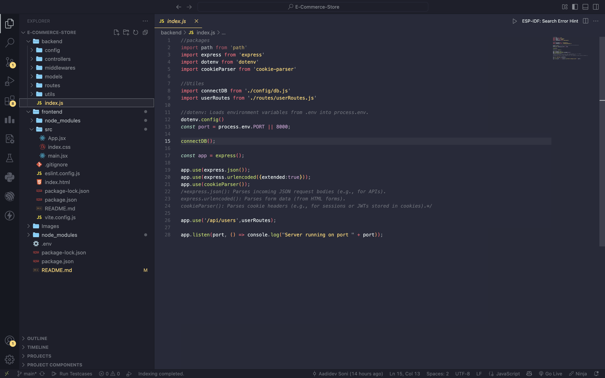
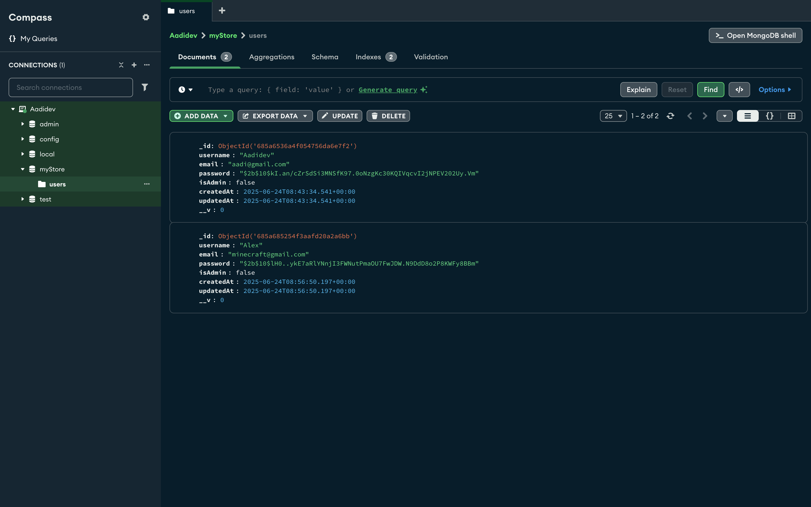
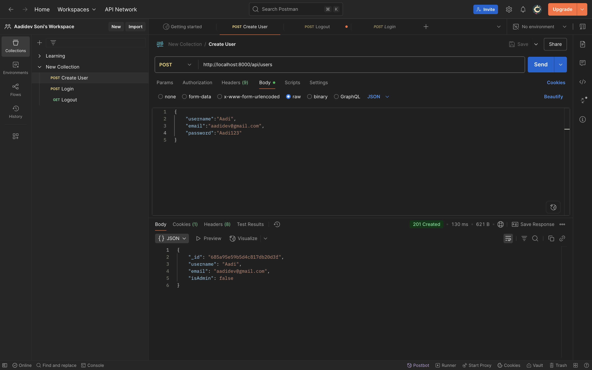
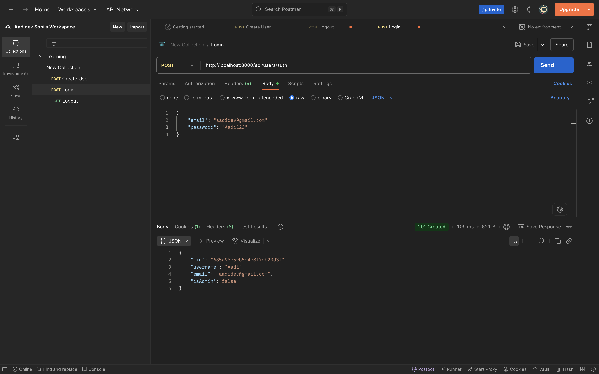
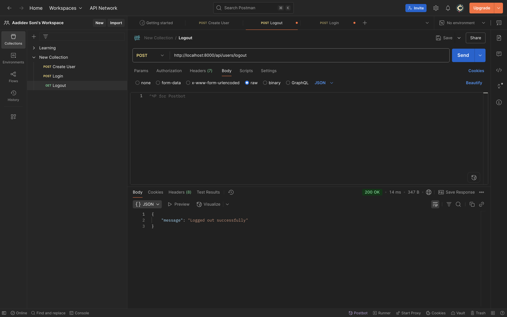
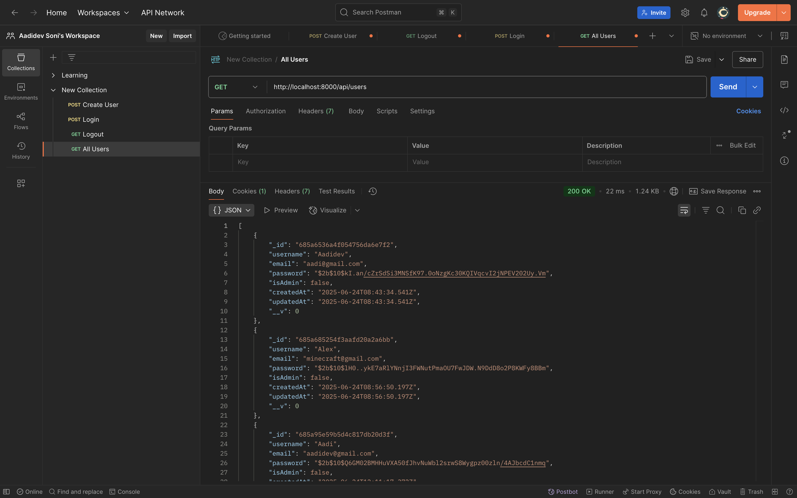
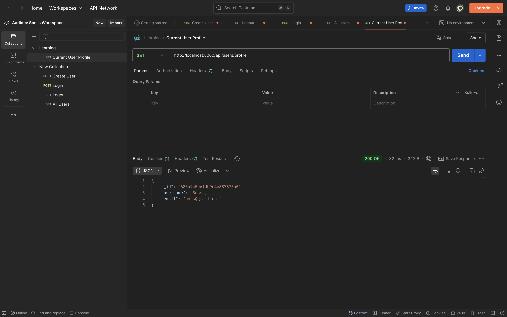
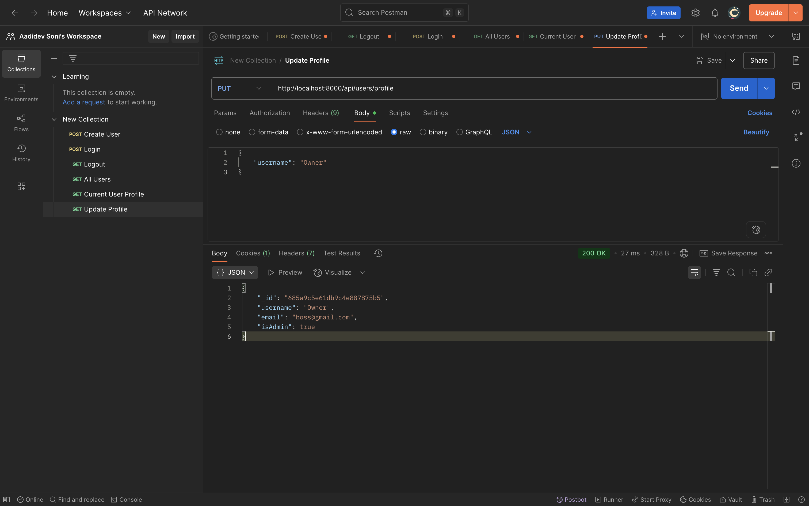

# E-Commerce-Store
<h1>Building an E-Commerce Store</h1>

<h1>Setup:</h1>

<h2>Creating frontend folder with react vite environment</h2>
<ul>
  <li>Open the folder with terminal and run:</li>
  <li>npm create vite@latest frontend -- --template react</li>
</ul>

<h2>Then, to install all dependencies:</h2>
<ul>
  <li>cd frontend</li>
  <li>npm i </li>
</ul>

Now, Open folder in VS Code and you will have all dependencies in frontend folder

npm init -y to initialize your project in main folder. This creates package.json

Create backend folder

<h2>Installing every dependencies for backend:</h2>

npm i nodemon multer mongoose jsonwebtoken express-formidable express-async-handler express dotenv cors cookie-parser concurrently bcryptjs

<h2>Use of each Packages</h2>

<h2>🔁 nodemon</h2>
Use: Automatically restarts your Node.js server when file changes are detected.
Example: Useful in development to avoid manually restarting the server every time you change a file.

<h2>📦 multer</h2>
Use: Middleware for handling multipart/form-data, used for uploading files.
Example: File/image uploads in user profiles or product listings.

<h2>🍃 mongoose</h2>
Use: ODM (Object Data Modeling) library for MongoDB.
Example: Allows defining schemas and models for interacting with MongoDB documents using JavaScript.

<h2>🔐 jsonwebtoken</h2>
Use: Creates and verifies JWT (JSON Web Tokens) for authentication and authorization.
Example: Used to protect routes and verify users in login/signup systems.

<h2>📝 express-formidable</h2>
Use: Parses form data, including file uploads (alternative to multer, simpler but less powerful).
Example: Used to handle form submissions without needing separate body-parser or multer.

<h2>⚙️ express-async-handler</h2>
Use: Simplifies error handling in async/await route handlers.
Example: Wrap your async controller functions to automatically forward errors to Express error middleware.

<h2>🌍 express</h2>
Use: Core framework for building web servers and APIs in Node.js.
Example: Handles routing, middleware, HTTP methods, etc.

<h2>🔐 dotenv</h2>
Use: Loads environment variables from .env file into process.env.
Example: Store secrets like DB_URI, JWT_SECRET, PORT, etc.

<h2>🔄 cors</h2>
Use: Enables Cross-Origin Resource Sharing.
Example: Allow your frontend (e.g., running on localhost:3000) to access your backend server (localhost:5000).

<h2>🍪 cookie-parser</h2>
Use: Parses Cookie header and populates req.cookies with an object.
Example: Used for session management or JWT stored in cookies.

<h2>🚀 concurrently</h2>
Use: Runs multiple commands/scripts in parallel.
Example: Run both frontend (npm start) and backend (npm run dev) in one command:

<h2>🔐 bcryptjs</h2>
Use: Library for hashing passwords.
Example: Hash user passwords before saving to the database and compare during login.

<h2>Installing every dependencies for frontend:</h2>

cd frontend 

npm i slick-carousel react-slick react-toastify react-router react-router-dom react-redux react-icons apexcharts rea
ct-apexcharts moment flowbite axios @reduxjs/toolkit @paypal/react-paypal-js

<h2>Use of each Packages</h2>

<h2>🎠 slick-carousel</h2>
Use: CSS/JS files for carousel/slider styling used by react-slick.
Example: Enables responsive image sliders or product carousels.

<h2>🚗 react-slick</h2>
Use: React component for building carousels/sliders.
Example: Product sliders on an e-commerce homepage.

<h2>🔔 react-toastify</h2>
Use: Display toast notifications (e.g., success, error, info messages).
Example: “Product added to cart” or “Login failed” popup.

<h2>🧭 react-router and react-router-dom</h2>
Use: For routing/navigation in React apps.
Example: Page navigation without full page reloads.

<h2>🧠 react-redux</h2>
Use: Connects React with Redux for global state management.
Example: Share user data or cart items across components.

<h2>🎨 react-icons</h2>
Use: Easily use popular icons (FontAwesome, Bootstrap Icons, etc.) in React.
Example: Add shopping cart or menu icons without SVG files.

<h2>📊 apexcharts</h2>
Use: A charting library to visualize data.
Example: Sales charts, order trends, etc.

<h2>📊 react-apexcharts</h2>
Use: React wrapper for apexcharts.
Example: Use ApexCharts in React with simple components.

<h2>🕒 moment</h2>
Use: Date and time manipulation.
Example: Format timestamps like 2 hours ago, 12/06/2024.

<h2>💧 flowbite</h2>
Use: UI component library built on Tailwind CSS.
Example: Add pre-styled modals, buttons, and navbars quickly.

<h2>🔗 axios</h2>
Use: Promise-based HTTP client for making API requests.
Example: Fetch products from your backend or send login data.

<h2>🧰 @reduxjs/toolkit</h2>
Use: Official, modern way to write Redux logic with less boilerplate.
Example: Create slices for cart, user, or orders; better dev experience than vanilla Redux.

<h2>💸 @paypal/react-paypal-js</h2>
Use: Integrate PayPal checkout buttons into your React app.
Example: Allow users to make payments through PayPal on your e-commerce platform.

<h2>CLEANUP:</h2>

frontend - public , src > assets , App.css , index.css

<h2>App.jsx modified to:</h2>

function App() {

  return (
    <>Hello</>
  )
}

export default App

<h2>main.jsx modified to remove:</h2>

import index.css

<h2>Scripts in package.json:</h2>

"scripts": {
  "backend": "nodemon backend/index.js",
  "frontend": "npm run dev --prefix frontend",
  "dev": "concurrently \"npm run frontend\" \"npm run backend\""
},

<h2>backend folder creation:</h2>
<ul>
  <li>config</li>
  <li>contollers</li>
  <li>middlewares</li>
  <li>models</li>
  <li>routes</li>
  <li>utils</li>
  <li>index.js</li>
</ul>

<h3>On running npm run backend, whatever is in the index.js runs</h3>
<h3>To run the front end, we write npm run frontend</h3>

<uL>
  <li>Creating db.js in config and connecting it to MongoDB</li>
  <li>Creating .env with port and URI and using it in db.js</li>
  <li>Adding "type":"module" to package.json</li>
  <li>Importing all packages and utiles and running the app and listening to the port</li>
</ul>

<h2>POSTMAN</h2>

Open Postman and add a blank collect new Request and add http://localhost:8000/ and SEND to see if the backend works

<h2>Download Tailwindcss as per:</h2>
<h3>https://tailwindcss.com/docs/installation/using-vite</h3>

Do all necessary commands and create an index.css and tailwind in App.jsx and dont forget to import './index.css'; in main.jsx

<h1>User Management</h1>
<h2>Creating a new user</h2>

App uses user api routes in index.js

Creating userModel

Creating userRoutes

Creating an asyncHandler for catching errors of every async functions

Creating userController

Testing it out using Postman using a post request

Getting user info from body and printing in console

Providing all validations

Creating a new user anhd testing it in Postman

The newly created user should be visible in mongoDB database

But we can see the user password in database

Handling visibility of password using bcrypt and hashing

<h2>How to create a token and set the token to cookies</h2>

createToken.js in utils

Create token using jwt

Set JWT as an HTTP only cookie

import createToken in userController

Create token just after saving the user to the database

Test by creating a new user in Postman and you can see the cookie creation in postman

This means that this user is not only in database but is also succesffully logged in

<h2>Logging in and Logging out of User</h2>
<h3>Logging In</h3>

Authorising user in router using a new link and loginUser controller

Create loginUser logic in userController

Go to Postamn and post email and password in http://localhost:8000/api/users/auth to login

<h3>Logging out</h3>

Create a new link and controller in router for logging out

>Create logout current user logic in user controller

Logout logic is just to delete the cookie that we created on logging in

Test the logging in and logging out in postman

<h2>Authentication and Authorisation</h2>

Create authenticate middleware and provide logic for authorisation and authentication

Now import authenticate and authorization to userRoute and if the user is authentricated nad authorized, we print all users

Provide the getAllUsers logic in userController

Postman create a admin account

Create a new Get request and set link to api/users to get all the users database

<h2>Updating specific user data</h2>
<h3>Getting current user profile</h3>

Creating a /profile route for updating profile

Creating getCurrentUserProfile controller

Getting current profile info in postman

<h3>Updating now</h3>

Add a put method and update controller to profile route

Create the update profile logic

Test in postman with a new put request to update user profile

